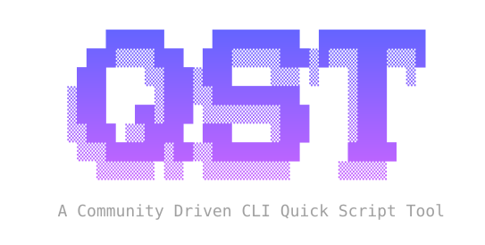
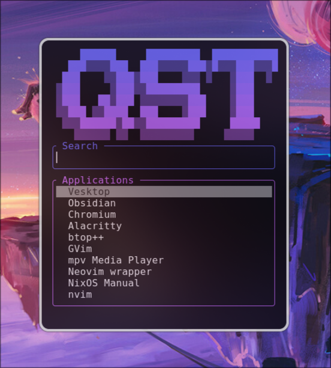

<p align="center">
  
</p>


Qst, pronounced "quest", is a TUI Linux application launcher built with Rust + Ratatui. Launch apps, browse files, and run scripts from one keyboard-first interface.

## Overview

- Fast `.desktop` app scanning with fuzzy search.
- Usage and favorites-based ordering.
- File explorer mode with path autocompletion.
- Extensible script system with a community catalog.
- Fully customizable layout and colors.

<p align="center">
  
</p>

## Quick start

```bash
# Install qst via Nix (recommended)
nix profile install "github:GitanElyon/qst"

# Launch qst
qst
```

Thats it! You can then start browsing apps, or install scripts from the community catalog at [awesome-qst](https://github.com/gitanelyon/awesome-qst).

## Install

Via Nix (recommended):
```bash
nix profile install "github:GitanElyon/qst"
```

Via the AUR (Arch Linux):
```bash
yay -S qst
```

Via Cargo:
```bash
cargo install --locked qst
```

Or build from source:
```bash
git clone https://github.com/GitanElyon/qst.git
cd qst
cargo install --locked --path .
```

## Usage

Run qst from the terminal:

```bash
qst
```

Or bind it to a global hotkey (e.g. `Super+Space`) in your desktop environment's keyboard settings. Hyprland example, to mimic `rofi`:

```
bind = $mod, space, exec, [float; size 350 400] $terminal -e qst
```

## Scripts

qst scripts extend the launcher with custom functionality — system info, todo lists, calculators, clipboard history, and more. Scripts live in `~/.config/qst/scripts/` and are triggered by typing their name.

With `loader.sh` installed, browse and install community scripts right from qst:

```
loader                    browse the catalog
loader <terms>            filter the catalog
loader u <script>         install or update a script
loader r <script>         remove a locally installed script
loader a <script> <alias> set an alias for a script
```

The community catalog lives in [awesome-qst](https://github.com/gitanelyon/awesome-qst). Scripts are simple executable files (shell, Python, Perl, and more) that follow a line-oriented protocol; see [API.md](API.md) to write your own.

## Keybindings

- `Up`/`Down`: move selection
- `Left`/`Right`: move cursor in input
- `Tab`: autocomplete path
- `Enter`: launch/open selected item
- `Alt+f`: toggle favorite
- `Ctrl+d`: toggle debug overlay
- `Esc`: quit

## Configuration

qst generates `~/.config/qst/config.toml` automatically on first run, or explicitly with:

```bash
qst --gen-config
```

The config controls layout, colors, keybindings, and behavior. Optional trigger aliases for scripts and apps can be defined in `~/.config/qst/alias.toml`:

```toml
[scripts]
"volume.sh" = "v!"
battery = ":"

[apps]
"btop++" = "alacritty -e btop"
```

## Docs

- [DOCS.md](DOCS.md) — full configuration, CLI options, and feature details
- [API.md](API.md) — script protocol reference
- [CHANGELOG.md](CHANGELOG.md) — release history
